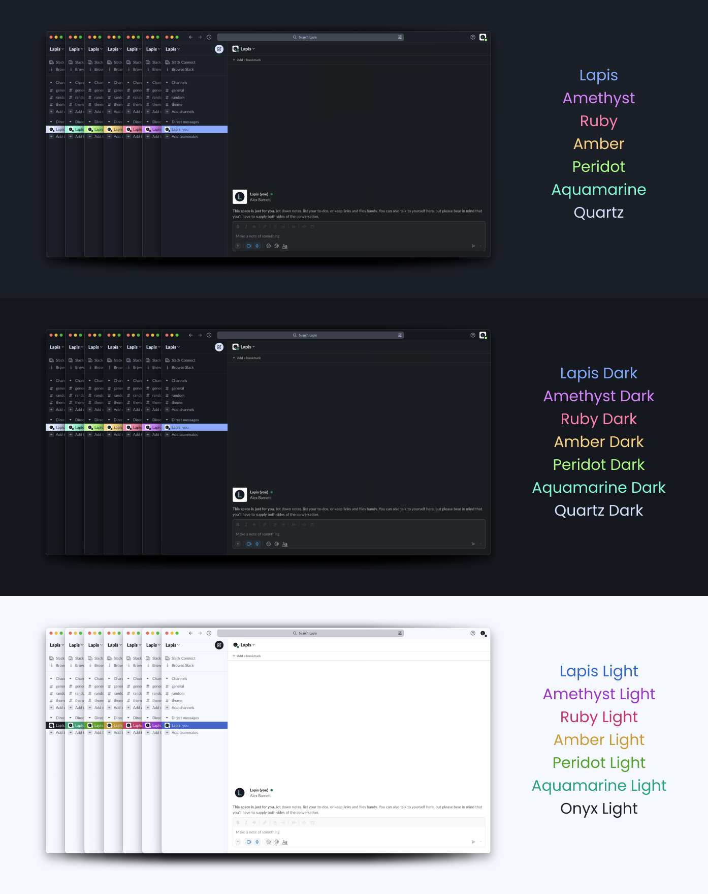

A dark blue inspired theme for Slack.

# Installation

- Select one of the variants listed below and copy it.
- Open **Slack** and go to **Preferences**.
- Select **Themes**.
- Paste the hex values copied from this file into the custom theme hex value input:

## Lapis

`#1B1F27,#121016,#83ABFC,#1B1F27,#2D3953,#D6E2FF,#ABFC83,#FC699A,#1B1F27,#D6E2FF`

## Lapis Amethyst

`#1B1F27,#121016,#D483FC,#1B1F27,#2D3953,#D6E2FF,#ABFC83,#FC699A,#1B1F27,#D6E2FF`

## Lapis Ruby

`#1B1F27,#121016,#FC83AB,#1B1F27,#2D3953,#D6E2FF,#ABFC83,#FC699A,#1B1F27,#D6E2FF`

## Lapis Amber

`#1B1F27,#121016,#FCD483,#1B1F27,#2D3953,#D6E2FF,#ABFC83,#FC699A,#1B1F27,#D6E2FF`

## Lapis Peridot

`#1B1F27,#121016,#ABFC83,#1B1F27,#2D3953,#D6E2FF,#ABFC83,#FC699A,#1B1F27,#D6E2FF`

## Lapis Aquamarine

`#1B1F27,#121016,#83FCD4,#1B1F27,#2D3953,#D6E2FF,#ABFC83,#FC699A,#1B1F27,#D6E2FF`

## Lapis Quartz

`#1B1F27,#121016,#D6E2FF,#1B1F27,#2D3953,#D6E2FF,#ABFC83,#FC699A,#1B1F27,#D6E2FF`

# Other Ports

- [Lapis Visual Studio Code Theme](https://marketplace.visualstudio.com/items?itemName=AlexBarnett.lapis-vscode)
- [Lapis Terminal.app](https://github.com/aslbarnett/lapis-theme-terminal-app)

# Feedback

If you see any issues with the theme, please [open an issue](https://github.com/aslbarnett/lapis-theme-slack/issues).

# License

[MIT License](./LICENSE)
